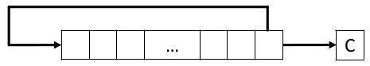

# Formulario ARM

## Flags

- N: Negative result from ALU flag
- Z: Zero result from ALU flag
- C: ALU operation Carried out
- V: ALU operation oVerflowed
- GE: Greater Than or Equal flag
  

## Comparison Instructions

- CMP <Rd>, <operand2> 
  substracts operand2 from Rd and updates the flags
- CMN <Rd>, <operand2> 
  adds operand2 to Rd and updates the flags
- TST <Rd>, <operand2> 
  computes the logical AND between operand2 and Rd; then updates all the flags except V.
- TEQ <Rd>, <operand2> 
  computes the logical EOR between operand2 and Rd; then updates all the flags except V.

## Accessing Program Status Register

- MRS <Rn>, <Sreg> 
  copies a special register into a register.
- MSR <Sreg>, <Rn> 
  copies a general purpose register into a special register.

Sreg can be **APSR, EPSR, IPSR, and PSR**.

**MRS r0, APSR** reads the flags and copies them to the uppermost nibble of r0.

## Arithmetic instructions

### Addition

- **ADD** <Rd>,<Rn>,<op2> 
  Rd = Rn + op2
- ADC <Rd>,<Rn>,<op2>
  Rd = Rn + op2 + C
- ADDW is like ADD, but it takes only a 12-bit value and it can not update
  flags.

With ADC it is possible to add 64-bit values:
ADDS r4,r0,r2
ADC r5,r1,r3
In the example r5,r4 = r1,r0 + r3,r2

### Subtraction

- **SUB** <Rd>,<Rn>,<op2> 
  Rd = Rn - op2
- SBC <Rd>,<Rn>,<op2>
  Rd = Rn - op2 + C - 1
- SUBW is like SUB, but it takes only a 12-bit value and it can not update flags.

With SBC it is possible to subtract 64-bit values
SUBS r4,r0,r2
SBC r5,r1,r3
In the example r5,r4 = r1,r0 - r3,r2

### Reverse subtraction

- RSB <Rd>,<Rn>,<op2>
  Rd = op2 - Rn + C – 1

### Multiplication

- MUL <Rd>, <Rn>, <Rm>
  multiplication with 32-bit result
- UMULL <Rd1>, <Rd2>, <Rn>, <Rm>
  unsigned multiplication with 64-bit result
- SMULL <Rd1>, <Rd2>, <Rn>, <Rm>
  signed multiplication with 64-bit result

**Operands must be registers**

### Multiplication with accumulation

- MLA <Rd>, <Rn>, <Rm>, <Ra>
  Rd = Rn * Rm + Ra
- MLS <Rd>, <Rn>, <Rm>, <Ra>
  Rd = Rn * Rm – Ra
- UMLAL <Rd1>, <Rd2>, <Rn>, <Rm>
  Rd1,Rd2 = Rn * Rm + Rd1,Rd2
- SMLAL <Rd1>, <Rd2>, <Rn>, <Rm>
  same as UMLAL, but with signed values.
  

### Division

- UDIV <Rd>, <Rn>, <Rm>
- SDIV <Rd>, <Rn>, <Rm>

**If Rn is not exactly divisible by Rm, the result is rounded toward zero.**

UDIV and SDIV **do not change the flags** (the suffix ‘S’ can not be added).

### Logic Instructions

- AND <Rd>, <Rn>, op2 ;Rn AND op2
- BIC <Rd>, <Rn>, op2 ;Rn AND NOT op2
- ORR <Rd>, <Rn>, op2 ;Rn OR op2
- EOR <Rd>, <Rn>, op2 ;Rn XOR op2
- ORN <Rd>, <Rn>, op2 ;Rn OR NOT op2
- MVN <Rd>, <Rn> ;NOT Rn
  

### Shift instructions

- LSL <Rd>, <Rn>, <op2>
  
- LSR <Rd>, <Rn>, <op2>
  
-  ISTRUZIONE CHE NON CAPiSCO DALLE SLIDES
  
  

### Rotate instructions

- ROR <Rd>, <Rn>, <op2>
  
- RRX <Rd>, <Rn>
  

## Directives

### Area

- AREA sectionName {,attr} {,attr}...

If sectionName starts with a number, it must be enclosed in bars e.g. |1_DataArea|

**|.text|** is used by the **C compiler**

Example: AREA Example,CODE,READONLY

##### Section attributes

- CODE: the section contains machine code
- DATA: the section contains data
- READONLY: the section can be placed in read-only memory
- READWRITE: the section can be placed in read-write memory
- ALIGN = expr: the section is aligned on a 2expr-byte boundary
  

### Register names

- name **RN** registerIndex
  You can assign other names with RN
  E.g. coeff1 RN 8
  

### Declaring constants

- name EQU expression
  

### Data allocation (DCB,DCW ecc...)

**{label} DCxx expr{,expr}...**

expr is a *numeric expression in the proper range* or *a string* (**with DCB only**)

*Each char is a byte in ASCII (i think)*

- DCB: define constant byte
- DCW: define constant half-word
- DCWU: define constant half-word unaligned
- DCD: define constant word **(32 bit)**
- DCDU: define constant word unaligned
  

### Align

asdad

