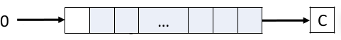

# Formulario ARM ASSEMBLER

## Flags

- N: Negative result from ALU flag
- Z: Zero result from ALU flag
- C: ALU operation Carried out
- V: ALU operation oVerflowed
- GE: Greater Than or Equal flag
  


## Comparison Instructions

- CMP \<Rd>, \<operand2> 
  substracts operand2 from Rd and updates the flags
- CMN \<Rd>, \<operand2> 
  adds operand2 to Rd and updates the flags
- TST \<Rd>, \<operand2> 
  computes the logical AND between operand2 and Rd; then updates all the flags except V.
- TEQ \<Rd>, \<operand2> 
  computes the logical EOR between operand2 and Rd; then updates all the flags except V.


## Accessing Program Status Register

- MRS \<Rn>, \<Sreg> 
  copies a special register into a register.
- MSR \<Sreg>, \<Rn> 
  copies a general purpose register into a special register.

Sreg can be **APSR, EPSR, IPSR, and PSR**.

**MRS r0, APSR** reads the flags and copies them to the uppermost nibble of r0.


## Arithmetic instructions

### Addition

- **ADD** \<Rd>,\<Rn>,\<op2> 
  Rd = Rn + op2
- ADC \<Rd>,\<Rn>,\<op2>
  Rd = Rn + op2 + C
- ADDW is like ADD, but it takes only a 12-bit value and it can not update
  flags.

With ADC it is possible to add 64-bit values:
ADDS r4,r0,r2
ADC r5,r1,r3
In the example r5,r4 = r1,r0 + r3,r2

### Subtraction

- **SUB** \<Rd>,\<Rn>,\<op2> 
  Rd = Rn - op2
- SBC \<Rd>,\<Rn>,\<op2>
  Rd = Rn - op2 + C - 1
- SUBW is like SUB, but it takes only a 12-bit value and it can not update flags.

With SBC it is possible to subtract 64-bit values
SUBS r4,r0,r2
SBC r5,r1,r3
In the example r5,r4 = r1,r0 - r3,r2

### Reverse subtraction

- RSB \<Rd>,\<Rn>,\<op2>
  Rd = op2 - Rn + C – 1

### Multiplication

- MUL \<Rd>, \<Rn>, \<Rm>
  multiplication with 32-bit result
- UMULL \<Rd1>, \<Rd2>, \<Rn>, \<Rm>
  unsigned multiplication with 64-bit result
- SMULL \<Rd1>, \<Rd2>, \<Rn>, \<Rm>
  signed multiplication with 64-bit result

**Operands must be registers**

### Multiplication with accumulation

- MLA \<Rd>, \<Rn>, \<Rm>, \<Ra>
  Rd = Rn * Rm + Ra
- MLS \<Rd>, \<Rn>, \<Rm>, \<Ra>
  Rd = Rn * Rm – Ra
- UMLAL \<Rd1>, \<Rd2>, \<Rn>, \<Rm>
  Rd1,Rd2 = Rn * Rm + Rd1,Rd2
- SMLAL \<Rd1>, \<Rd2>, \<Rn>, \<Rm>
  same as UMLAL, but with signed values.
  

### Division

- UDIV \<Rd>, \<Rn>, \<Rm>
- SDIV \<Rd>, \<Rn>, \<Rm>

**If Rn is not exactly divisible by Rm, the result is rounded toward zero.**

UDIV and SDIV **do not change the flags** (the suffix ‘S’ can not be added).

### Logic Instructions

- AND \<Rd>, \<Rn>, op2 ;Rn AND op2
- BIC \<Rd>, \<Rn>, op2 ;Rn AND NOT op2
- ORR \<Rd>, \<Rn>, op2 ;Rn OR op2
- EOR \<Rd>, \<Rn>, op2 ;Rn XOR op2
- ORN \<Rd>, \<Rn>, op2 ;Rn OR NOT op2
- MVN \<Rd>, \<Rn> ;NOT Rn
  

### Shift instructions

- LSL \<Rd>, \<Rn>, \<op2>
  
- LSR \<Rd>, \<Rn>, \<op2>
  
-  ISTRUZIONE CHE NON CAPiSCO DALLE SLIDES
  

### Rotate instructions

- ROR \<Rd>, \<Rn>, \<op2>
  
- RRX \<Rd>, \<Rn>
  


## Directives

### Area

- AREA sectionName {,attr} {,attr}...

If sectionName starts with a number, it must be enclosed in bars e.g. |1_DataArea|

**|.text|** is used by the **C compiler**

Example: AREA Example,CODE,READONLY

#### Section attributes

- CODE: the section contains machine code
- DATA: the section contains data
- READONLY: the section can be placed in read-only memory
- READWRITE: the section can be placed in read-write memory
- ALIGN = expr: the section is aligned on a 2expr-byte boundary
  

### Register names

- name **RN** registerIndex
  You can assign other names with RN
  E.g. coeff1 RN 8
  

### Declaring constants

- name EQU expression
  

### Data allocation (DCB,DCW ecc...)

**{label} DCxx expr{,expr}...**

expr is a *numeric expression in the proper range* or *a string* (**with DCB only**)

*Each char is a byte in ASCII (i think)*

- DCB: define constant byte
- DCW: define constant half-word
- DCWU: define constant half-word unaligned
- DCD: define constant word **(32 bit)**
- DCDU: define constant word unaligned
  

### Align

The ALIGN directive aligns the current location to a specified
boundary by padding with zeros

ALIGN {expr{, offset}}

ALIGN=4 for examble align the memory area to 4 bytes

### Space

The SPACE directive reserves a zeroed block of memory:

{label} SPACE expr

eg .long_var SPACE 8


## Constants and literal pools

### MOV

- MOV \<Rd>, \<Rm> {, shift}
- MOV \<Rd>, #\<constant>

MOV cannot assign a program or data address

#### Constant valid values

- a 16-bit value (0-65535)
- a value obtained by shifting left an 8-bit value
- of the form 0x00XY00XY
- of the form 0xXY00XY00
- of the form 0xXYXYXYXY

### MVN

- MOV \<Rd>, \<Rm> {, shift}
- MOV \<Rd>, #\<constant>

The MVN instruction moves a one’s complement of the
operand into a register.

**The assembler can change a MOV into a MVN if the value is**
**valid for MVN and not for MOV.**

### MOVT

- MOVT \<Rd>, #\<constant>

MOVT moves a 16-bit value in the high halfword of a
register.

### LDR

- LDR \<Rd>, =\<constant>
  LDR \<Rd>, [PC, #\<offset>] after save the constant in LiteralPool
- MOV \<Rd>, #\<constant>
- LDR \<Rd>, =\<label> creates a constant in a literal pool and uses a PC relative load to get the data
- ADR \<Rd>, \<label> adds or subtracts an offset to/from PC
  LDR \<Rd>, [PC, #\<offset>]
  If the offset is higher than 4095 bytes, ADRL must be used
  instead of ADR


## Accessing memory

### LDR

- LDR \<Rd>, [ \<R> ]
- LDRB \<Rd>, [ \<R> ]
- LDRH\<Rd>, [ \<R> ]
- LDRSB \<Rd>, [ \<R> ] **Signed**
- LDRSH \<Rd>, [ \<R> ] **Signed**
- LDRD \<R1d> \<R2d>, [ \<R> ]
- LDM

### STR

- STR \<R>, [ \<Rd> ]
- STRB \<R>, [ \<Rd> ]
- STRH\<R>, [ \<Rd> ]
- STRSB \<R>, [ \<Rd> ] **Signed**
- STRSH \<R>, [ \<Rd> ] **Signed**
- STRD \<R1> \<R2>, [ \<Rd> ] 
- STM

### Pre-Indexed addressing

- load/store \<Rd>, [\<Rn>,\<offset>]{!}

The offset can be a register or a 12-bit constant

! can be used to update Rn value at the end of the execution

- LDR R1, [R0, #8]
- LDR R1, [R0, #8] ! **Update R0**
- LDR R1, [R0, R2]

Similar to V[i+1] in C, if ! is present it is V[++1]

### Post-index addressing

- load/store \<Rd>, [\<Rn>], \<offset>

Similar ti V[i++] in C


## Branch

- B \<label>
- BX \<Rn>
- BL \<label>
- BLX \<Rn>

### Conditional branch

| ??    | Flags       | Meaning       |
| ----- | ----------- | ------------- |
| EQ    | Z=1         | equal         |
| CS HS | C=1         | unsigned >=   |
| MI    | N=1         | negative      |
| VS    | V=1         | overflow      |
| HI    | C=1 & Z=0   | unsigned >    |
| GE    | N>=V        | signed >=     |
| GT    | Z=0 or N=V  | signed>       |
| NE    | Z=0         | not equal     |
| CC LO | C=0         | unsigned \<    |
| PL    | N=0         | positive or 0 |
| VC    | V=0         | no overflow   |
| LS    | C=0 & Z=1   | unsigned \<=   |
| LT    | N!=V        | signed \<      |
| LE    | Z=1 or N!=V | signed \<=     |

- CBZ \<Rn>, \<label>
  jumps to label if Rn = 0
- CBNZ \<Rn>, \<label>
  jumps to label if Rn ≠ 0

**Only forward branch is possible (4-130 byte)**

**Rn must be among r0-r7**


## STACK

### LDM and STM

- LDM{xx}/STM{xx} \<Rn>{!}, \<regList>

xx specifies the addressing mode, i.e., how and when Rn is updated

With ! , Rn is set to the updated value

#### List of registers

Example: {r0-r4, r10, LR} indicates r0, r1, r2, r3, r4, r10,
r14.

PC can appear only with LDM and only if LR is missing in the list.

Example: {r8, r1, r3-r5, r14} indicates r1, r3, r4, r5, r8,
r14.

#### Addressing modes

- IA: increment after (default)
- DB: decrement before

| Stack type      | PUSH                     | POP                       |
| --------------- | ------------------------ | ------------------------- |
| Full descending | STMDB<br/>STMFD          | LDM<br />LDMIA<br />LDMFD |
| Empty Ascending | STM<br/>STMIA<br />STMEA | LDMDB<br />LDMEA          |

### PUSH and POP

- • PUSH \<regList> 
  is the same as STMDB SP!, \<regList>
- • POP \<regList> 
  is the same as LDMIA SP!, \<regList>

### Subroutine

- BL \<label> and BLX \<Rn>
- write the address of the next instruction to LR
- write the value of label or Rn to PC

### Nested calls to subroutines

- PUSH {regList, LR}
- POP {regList, PC}

Where regList is the list of registers used in the previous routine


## Supervisor call (SVC)

### SVC instruction

```assembly
SVC_Handler	PROC
			EXPORT 	SVC_Handler	[WEAK]
			B		.
			ENDP
```

- {lable} SVC immediate

#### Get the immediate

```assembly
SVC_Handler
			LDR R0,[SP,#24]
			LDR	R1,[R0,#-4]
			BIC R1,0xFF000000
			LSR R1,#16
			...
			BX LR ;return and restore registers from the previous state
END
```

### CONTROL register

- **CONTROL[2]**
  • =0 FPU not active
  • =1 FPU active
- **CONTROL[1]**
  • =0 In handler mode - **MSP** is selected. No alternate stack possible for handler mode.
  • =0 In thread mode - Default stack pointer **MSP** is used.
  • =1 In thread mode - Alternate stack pointer **PSP** is used.
- **CONTROL[0]** 
  • =0 In thread mode and **privileged** state.
  • =1 In thread mode and **user** state

After **RESET** program is in **privileged** state and use **MSP** as **SP**

#### Setup User + PSP

```assembly
MOV		R0, #3
MSR		CONTROL, R0
LDR 	SP, =Stack_Process
```


# FORMULARIO ARM ASM+C

## INTRODUCTION

### Launch main()

```assembly
IMPORT __main
LDR R0, =__main
BX R0
```

### ABI


